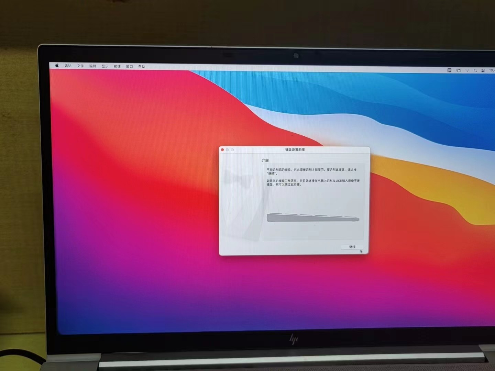

# 黑苹果 OpenCore配置 for HP-EliteBook-855G7-Notebook-Hackintosh

### Supports MacOS 10.13.x ~ 14.0.x

## BIOS设置（重要）
#### disable 禁用
- Fast Boot(快速启动)
- CSM(兼容性支持模块)
- EHCI/XHCI Hand-off(接手 EHCI/XHCI 控制)
#### enable 开启
- Above 4G decoding(大于 4G 地址空间解码)
- OS type: other types(操作系统类型: 其他)

## 软件说明
- OpenCore 版本：0.9.6

| Type          | Name   |
| --------      | -----  |
|macOS          |   Bigsur 11.6      |
|SMBIOS         |   iMac Pro 16.3   |
| CPU           |   AMD 4750U       |  
| GPU           |   AMD Radeon Graphics 512MB  |
|主板           |   惠普 8760    |
|PCIE3.0        |   英特尔 SSDPEKNW010T8_1TB固志硬盘 |
|WIFI           |   英特尔AX200  |

# 正常工作

 - [x] Wi-Fi
 - [x] 蓝牙
 - [x] 音频
 - [x] 显示器
 - [x]  键盘
 - [x] 触控板
 - [x] USB

# 未正常工作

 - [ ] 麦克风
 - [ ] 有线网卡
 - [ ] 摄像头

# AMD内核设置
将 B8000000 0000/BA000000 0000/BA000000 0090*  更改为B8 <核心数> 0000 0000/BA <核心数> 0000 0000/BA <核心数> 0000 0090*
用与您的物理核心计数匹配的十六进制值替换<核心数>。
 
| 核心          | 替换数值   |
| --------      | -----  |
|4 Core	|04|
|6 Core	|06|
|8 Core	|08|
|12 Core	|0C|
|16 Core	|10|
|24 Core	|18|
|32 Core	|20|

## 其他
- [OpenCore 实时编译地址](https://github.com/williambj1/OpenCore-Factory/releases)
- [Kexts 下载地址](https://gitee.com/evu/Easy-Kexts)
- [主题资源文件 OcBinaryData](https://github.com/acidanthera/OcBinaryData)
- [ACPI定制USB端口](https://github.com/daliansky/OC-little/blob/master/15-ACPI%E5%AE%9A%E5%88%B6USB%E7%AB%AF%E5%8F%A3/README.md)
- [Intel无线网卡](
https://github.com/OpenIntelWireless/itlwm/releases)
- [AMD Vanilla OpenCore](https://github.com/AMD-OSX/AMD_Vanilla)
- [AMD Processor](https://github.com/trulyspinach/SMCAMDProcessor) SMCAMDProcessor
- [LucyRTL8125Ethernet](https://github.com/Mieze/LucyRTL8125Ethernet)
- [驱动更新列表 2020年7月](https://heipg.cn/drivers/drivers-for-hackintosh-202007.html)

